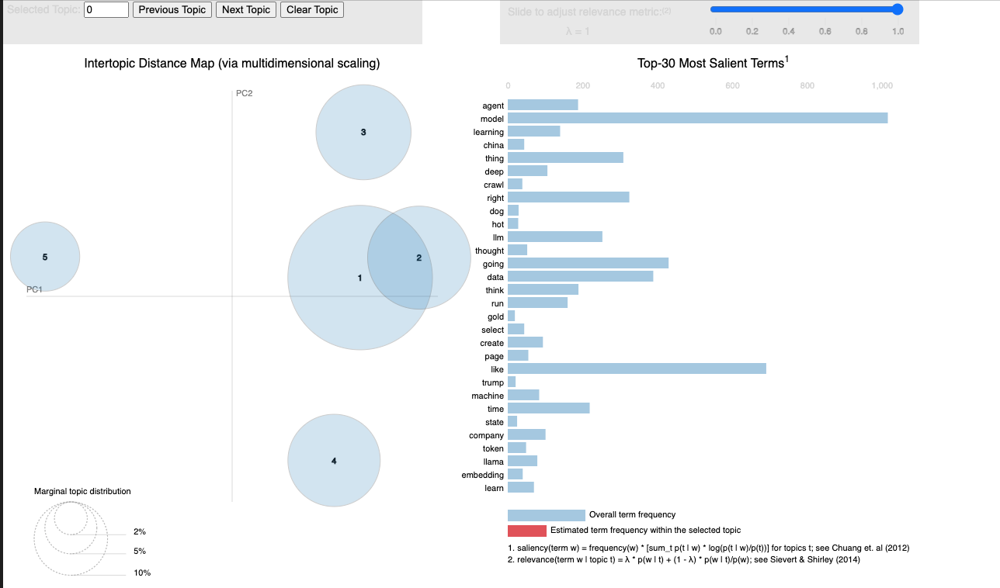

# 🎥 Real-Time YouTube Data Pipeline: Topic Modeling with LDA & BERTopic 

<p align="center">
  
</p>
<p align="center">
  
</p>


## 📖 Overview  
This project implements a fully automated, end-to-end streaming data pipeline that extracts, processes, and analyzes YouTube video metadata in real time. Leveraging Apache Airflow, Kafka, and Apache Spark, the pipeline ingests data from the YouTube API and processes it efficiently to generate meaningful insights.

The primary objective is to perform topic modeling on streaming YouTube video data to uncover trends, discussions, and themes within the content. This is achieved using Latent Dirichlet Allocation (LDA) and BERTopic, two powerful NLP-based topic modeling techniques.


## Tech Stack & Workflow:

### 1. YouTube API (Data Ingestion)
- Fetches real-time video metadata (**title, description, tags, comments**).
- Extracts data from **trending and relevant videos**.

### 2. Apache Kafka (Streaming Layer)
- Handles **real-time ingestion** of YouTube data.
- Ensures **reliable data flow** to downstream processing.

### 3. Apache Airflow (Workflow Orchestration)
- Manages the **entire data pipeline** with DAGs.
- Automates **scheduling, monitoring, and retries**.

### 4. Apache Spark (Data Processing)
- **Cleans, preprocesses, and transforms** YouTube text data.
- Applies **TF-IDF vectorization** for feature extraction.

### 5. NLP-based Topic Modeling
- **LDA (Latent Dirichlet Allocation)**: Identifies **hidden topics** within the dataset.
- **BERTopic**: Uses **BERT embeddings** to extract **contextually rich topics**.

## How to Use:

### 1. Clone the repository:

   ```bash
   git clone https://github.com/srikarpk150/StreamLineYT.git 
   ```

### 2. Set Up Environment Variables
Create a .env file in the root directory and add the following credentials:

    ```sh
    GOOGLE_API_KEY=<your_google_api_key>
    MONGODB_URI=<your_mongodb_uri>
    YOUTUBE_OAUTH_CLIENT=<your_youtube_oauth_client>
    ```

### 3. Install Docker and Run Services
- Install Docker if not already installed.
- Navigate to the folder containing the docker-compose.yml file.
- create folders - `logs`, `config`, `plugins` or run `mkdir logs`, `mkdir config`, `mkdir plugins`
- Run the following command to start the services:

    ```bash
    docker-compose up -d
    ```
- Verify that all services are running:

    ```bash
    docker ps
    ```

Open Airflow UI at: http://localhost:8080
Open Kafka Confluent UI at: http://localhost:9021

### 4. Run the YouTube DAG in Airflow
- Navigate to Airflow UI (localhost:8080).
- Locate the YouTube Video DAG.
- Trigger the DAG and enter the topic which you want to search or use the default option to start processing YouTube data.

## Running Spark Streaming & Topic Modeling
### 1. Set Up a Virtual Environment
- Create a virtual environment using conda:

    ```bash
    conda create --name youtube-streaming-pipeline python=3.8 -y
    conda activate youtube-streaming-pipeline
    ```

### 2. Install Dependencies
- Navigate to the spark/ directory and install dependencies:

    ```bash
    pip install -r requirements.txt
    ```
### 3. Run the Jupyter Notebooks
Execute the Spark Streaming notebooks for topic modeling
- Open the respective notebooks and run them to analyze and model YouTube topics using LDA and BERTopic.

<p align="center">
  
</p>

## Key Features & Outcomes:

**Real-time YouTube data extraction and streaming**  
**Scalable and fault-tolerant Kafka-based architecture**  
**Automated DAG-based pipeline with Airflow**  
**Advanced NLP techniques for topic modeling**  
